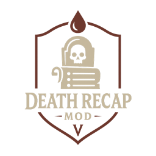

# PvPBreakdown- Leaderboard, Killfeed, and post fight breakdowns

## Features

- Announce PvP kills in chat
- PvP Leaderboard
- Killstreak Leaderboard
- Death Leaderboard
- Announce kill streaks
- Track Player PvP assists
- Announce max level used in the fight (works with weapon swapping)
- Optionally announce player assists
- Optionally announce PVP kill steals by mobs
- Discord webhook integration for making announcements
- Full post fight breakdown of who hit who with what abilities (webhook only)
- Post fight summary giving summarized breakdown of damage taken in fight (webhook only)

## RoadMap

- More detailed death messages when units kill steal
- Specific message when sun kill steals
- Option to give assist, kill, or neither when units kill steal
- Reward system that can be set by admins for hitting pvp benchmarks
- Custom Chat messaging when gear scrore gap is high
- Gank (at VBloods) detection and custom messaging in chat when players die to ganks
- Get clan based stats

## Known Issues

- Player's using unstuck during fight will not be tracked in any way by the mod

## Setttings

This is a preview of the settings file, the plugin will generate a file with the default values when run.

```ini
[General]

## Announce kills in chat
# Setting type: Boolean
# Default value: true
AnnounceKills = true

## Minimum killstreak count that must be lost to be announced.
# Setting type: Int32
# Default value: 3
AnnounceKillstreakLostMinimum = 3

## Announce killstreaks in chat
# Setting type: Boolean
# Default value: true
AnnounceKillstreak = true

## Include player gear levels in announcements.
# Setting type: Boolean
# Default value: true
IncludeLevel = true

## Use max gear level instead of current gear level (This will override userMaxPerFightLevel).
# Setting type: Boolean
# Default value: false
UseMaxLevel = false

## Use max gear used in the current fight.
# Setting type: Boolean
# Default value: true
UseMaxPerFightLevel = true

```

# credits and thanks:

This mod is based on Deca's [Killfeed](https://thunderstore.io/c/v-rising/p/deca/Killfeed/)
Want to give thanks to Deca for all his work making kf, bloodstone, and vfc. Additionally everyone in the VrisingModing discord who helped answer questions.

# Support:

- I go by `Morphine` on the Vrising modding [Modding VRising Mod ](]https://vrisingmods.com/discord)
- Additionally feel free to open issues on the github

# Pull Requests:

- It is highly encouraged you open an issue before putting in the work to make a pull request.
  That being said I'm open to looking and reviewing at the time of writing this so feel free to open suggestions or bug reports.
- I will try to be quick to respond
